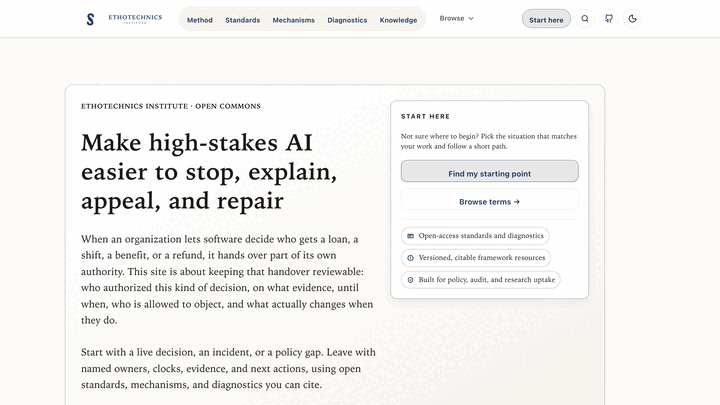

# ethotechnics.org

[](https://github.com/zz-plant/ethotechnics/actions/workflows/site-checks.yml)
[](https://creativecommons.org/licenses/by-sa/4.0/)
[](https://github.com/zz-plant/ethotechnics/stargazers)
[](https://github.com/zz-plant/ethotechnics/commits/main)
[](https://ethotechnics.org)
[](https://ethotechnics.org/field-notes/rss.xml)

<p align="center">
  
</p>

This repository powers [ethotechnics.org](https://ethotechnics.org), a content-driven site exploring
ethical technology, human-centered design, and the sociotechnical systems that shape them. The
project favors lean, fast-loading pages and clear storytelling.

**Live site:** <https://ethotechnics.org>

## Table of contents

- [Highlights](#highlights)
- [Requirements](#requirements)
- [Contributor quick start](#contributor-quick-start)
- [Quick start](#quick-start)
- [Common scripts](#common-scripts)
- [Testing](#testing)
- [Security headers](#security-headers)
- [Deployment to Cloudflare Workers](#deployment-to-cloudflare-workers)
- [Documentation map](#documentation-map)
- [Project structure](#project-structure)
- [Contributing](#contributing)
- [License](#license)

## Highlights

- Built with Astro 7 and TypeScript for fast, accessible content delivery.
- Cloudflare Workers deployment with a dedicated `wrangler.toml` configuration.
- Hardened security headers set in `src/middleware.ts`.
- Playwright end-to-end tests plus Bun unit/component coverage.

## Support the project

- ⭐ Star the repo to help others discover ethical technology and human-centered design resources.
- Share the live site with teammates or students who care about responsible technology practice.
  - X: <https://twitter.com/intent/tweet?text=Ethotechnics%3A%20ethical%20technology%20and%20human-centered%20design&url=https%3A%2F%2Fethotechnics.org>
  - LinkedIn: <https://www.linkedin.com/sharing/share-offsite/?url=https%3A%2F%2Fethotechnics.org>
- Subscribe to Field Notes via RSS: <https://ethotechnics.org/field-notes/rss.xml>.
- Follow updates on GitHub to track new essays, research notes, and design references.

## Keywords

Ethical technology, human-centered design, sociotechnical systems, Astro, Cloudflare Workers,
accessible web performance, content strategy, digital ethics, UX research, responsible innovation.

## Requirements

- Node.js 20.x (use `nvm use` to match the pinned toolchain).
- Bun 1.3+ (see `.nvmrc` for the Node version and `bun.lock` for dependencies).

## Contributor quick start

1. Align toolchains: `nvm use`
2. Install dependencies: `bun install`
3. Run the default PR check suite: `bun run check`
4. Run the full release/nightly checks when needed: `bun run check:full`

For a one-shot bootstrap (great for Codex and fresh clones), run:

```bash
bun run setup:codex
```

## Quick start

1. Install dependencies: `bun install`
2. Run the dev server: `bun dev`
3. Build the Worker bundle: `bun run build`
4. Preview the build: `bun run preview` (Astro) or `bun run preview:cf` (Wrangler Worker)
5. For deeper setup and troubleshooting tips, see [`docs/local-development.md`](docs/local-development.md).

## Common scripts

| Command                  | Purpose                                                                                  |
| ------------------------ | ---------------------------------------------------------------------------------------- |
| `bun dev`                | Run the Astro development server.                                                        |
| `bun run build`          | Validate content JSON and build the Worker bundle (`dist/server/entry.mjs`).             |
| `bun run build:search`   | Generate the Pagefind search index in `dist/pagefind`.                                   |
| `bun run preview`        | Preview the Worker build locally.                                                        |
| `bun run preview:cf`     | Preview the Worker build via Wrangler with local bindings.                               |
| `bun run check`          | Run default PR checks: lint, type checks, Astro checks, JSON validation, and unit tests. |
| `bun run check:full`     | Run deep checks: default PR checks plus SEO audit and coverage unit tests.               |
| `bun run clean`          | Remove generated local build/test artifacts while keeping dependencies installed.         |
| `bun run clean:all`      | Remove all generated artifacts plus local dependencies and Playwright caches.             |
| `bun run lint`           | Lint Astro and TypeScript sources under `src/`.                                          |
| `bun run lint:fix`       | Lint and auto-fix Astro and TypeScript sources under `src/`.                             |
| `bun run format`         | Format Markdown and source files with Prettier.                                          |
| `bun run format:check`   | Check formatting with Prettier (CI-friendly).                                            |
| `bun test`               | Run unit and component tests with Bun.                                                   |
| `bun run test:e2e`       | Build and run Playwright against the preview server (Chromium, Firefox, WebKit).         |
| `bun run test:e2e:smoke` | Build and run a Chromium-only Playwright smoke suite.                                    |
| `bun run test:e2e:ci`    | Build and run Playwright on Chromium only for CI.                                        |
| `bun run deploy`         | Build and deploy the Worker to Cloudflare using Wrangler.                                |

## Safe local cleanup

The following paths are generated and safe to delete locally when you want to reclaim disk space:

- `dist/`, `.astro/`, `.vercel/`, `coverage/`
- `test-results/`, `playwright-report/`, `blob-report/`, `playwright/.cache/`, `playwright/.auth/`
- `astro_check_log.txt`
- `node_modules/` (recreated with `bun install`)

Use `bun run clean` for standard output cleanup and `bun run clean:all` when you also want to
remove dependencies and Playwright caches.

## Testing

### End-to-end (Playwright)

- After installing dependencies, run `bunx playwright install --with-deps` to install browser
  binaries and system packages.
- `bun run test:e2e` builds the Worker bundle and runs Playwright against `bun run preview`
  across Chromium, Firefox, and WebKit.
- `bun run test:e2e:smoke` and `bun run test:e2e:ci` run the same flow on Chromium only for
  faster PR and CI validation; run the full three-browser matrix locally before release.
- Use `bun run preview:cf` when you need to validate Worker runtime behavior (Durable Objects,
  bindings, or Workers KV) locally.
- Override the preview target with `PLAYWRIGHT_BASE_URL` (defaults to `http://127.0.0.1:4321`).
- Cloudflare Pages can run the suite using `CF_PAGES_URL`; enable testing in the dashboard to run
  Playwright after the Worker build.
- If Playwright browser downloads fail:
  - Reuse cached downloads with `PLAYWRIGHT_BROWSERS_PATH=~/.cache/playwright`.
  - Confirm proxies or firewalls are not blocking `https://playwright.azureedge.net`.
  - Use a mirror via `PLAYWRIGHT_DOWNLOAD_HOST=https://your-mirror.example.com`.

### Unit and component tests (Bun Test)

- `bun test` runs the test suite.
- Component rendering tests use the experimental Astro container (`src/test/astro-container.ts`) and
  run under Bun with happy-dom helpers.
- CI uses `bun run test:unit:ci` to execute once with coverage.

### Environment configuration

- Copy `.env.example` to `.env.local` for local development. Astro automatically loads `.env`,
  `.env.local`, and environment-specific files (such as `.env.development`).
- No environment variables are required today, but add new entries to `.env.example` if the project
  adopts external services.

## Security headers

Requests pass through `src/middleware.ts`, which normalizes legacy ethotechnics.com hosts and
appends a hardened header set to every response:

- **HSTS** (`Strict-Transport-Security`): one-year max age with subdomains and preload to enforce
  HTTPS everywhere.
- **Content-Security-Policy:** locks content to `self`, blocks frames and plug-ins, restricts
  styles to the site origin, and permits images from the site, `https:` origins, or `data:` URLs.
- **Referrer-Policy:** `no-referrer` to avoid leaking navigation history.
- **X-Content-Type-Options:** `nosniff` to disable MIME-type sniffing.
- **Permissions-Policy:** disables camera, geolocation, microphone, and payment features.

## Deployment to Cloudflare Workers

The site uses the official Cloudflare adapter for Astro to produce a Worker-compatible server
build. `wrangler.toml` captures the base Worker name and compatibility settings; the generated
`dist/server/wrangler.json` captures the built entrypoint (`dist/server/entry.mjs`) and assets.
Session storage is not enabled by default; if you add it later, define the KV binding in
`wrangler.toml` before deploying.

1. Ensure the adapter is installed (`@astrojs/cloudflare`) and configured in `astro.config.mjs` with
   `output: "server"`.
2. The adapter is configured to use Cloudflare's image service and to exclude static assets
   (`/_astro/*`, `/assets/*`) from the server function so they can be served directly via the assets
   binding.
3. Build the Worker bundle with `bun run build` when you need to preview or inspect the output.
   The generated Worker entry is emitted to `dist/server/entry.mjs`, and the build runs
   `patch:cf-worker` so the generated Astro app renders buffered HTML under `nodejs_compat`.
4. Deploy with Wrangler using the repo defaults: `bun run deploy`.
   - The deploy script runs Wrangler via `bunx`, so no global installation is required.
   - The deploy script runs `bun run build` first so the upload always reflects the latest bundle.
   - The deploy command uses the generated `dist/server/wrangler.json` so Wrangler uploads the
     server entry and the matching `dist/client` assets together.
   - The build copies `.assetsignore` from `public/` to `dist/client` so Wrangler only serves
     client assets from the asset binding.
5. Configure DNS for `ethotechnics.org` to point to the Cloudflare Worker route you set in Wrangler.

## Documentation map

- Start with [`docs/README.md`](docs/README.md) for how the docs folder is organized, when to add a
  new guide, and formatting expectations.
- [`docs/contributor-workflow.md`](docs/contributor-workflow.md) outlines the change loop, required
  checks, and formatting conventions for day-to-day work.
- [`docs/architecture.md`](docs/architecture.md) covers the rendering model, middleware, and
  Cloudflare Worker deployment. Update it when routing, layouts, or adapters change.
- [`docs/specifications.md`](docs/specifications.md) provides a high-level snapshot of site goals,
  routing, and delivery defaults.
- [`docs/adding-pages.md`](docs/adding-pages.md) walks through creating new Astro routes without
  breaking shared navigation and metadata. Use it as the checklist for new content.
- [`docs/page-specifications.md`](docs/page-specifications.md) lists route-by-route expectations
  for data, layout, and accessibility.
- [`docs/content-data.md`](docs/content-data.md) documents JSON-backed content sources, schemas,
  and validation steps.
- [`docs/content-components.md`](docs/content-components.md) catalogs the page intro, section
  blocks, cards, and other building blocks reused across routes. Extend it when adding shared UI.
- [`docs/local-development.md`](docs/local-development.md) captures local setup, previews, and
  troubleshooting tips.
- [`docs/cloudflare-playwright.md`](docs/cloudflare-playwright.md) captures how to run the
  Playwright suite on Cloudflare Pages after the Worker build completes and how to surface test
  results in that environment.
- [`docs/testing-todos.md`](docs/testing-todos.md) tracks current test coverage and outstanding
  gaps to prioritize.
- [`docs/glossary.md`](docs/glossary.md) defines shared terminology used across the site and docs.
- [`docs/diagnostics-outputs.md`](docs/diagnostics-outputs.md) and
  [`docs/usability-audit.md`](docs/usability-audit.md) collect diagnostics output references and UX
  review findings.

## Project structure

- `src/pages`: Astro routes, starting with [`src/pages/index.astro`](src/pages/index.astro) for the
  homepage content.
- `src/layouts`: Shared layouts such as [`src/layouts/BaseLayout.astro`](src/layouts/BaseLayout.astro),
  which wires global SEO, fonts, and the navigation shell.
- `src/components`: Interactive islands and shared UI components such as the navigation in
  [`src/components/Navigation.astro`](src/components/Navigation.astro).
- `src/styles`: Global styles and theme tokens defined in [`src/styles/global.css`](src/styles/global.css).

## Contributing

- Start with [`CONTRIBUTING.md`](CONTRIBUTING.md) for the canonical contribution workflow.
- Keep changes focused and easy to review; align with existing naming and formatting.
- Use Bun (not npm or yarn) and format Markdown/code with `bunx prettier --write`.
- Run `bun run check` for code or mixed changes; run `bun run check:full` for release
  prep or periodic deep validation. Docs-only updates can skip both.
- CI mirrors `bun run check` on pull requests via the Site checks workflow.
- Read [`AGENTS.md`](AGENTS.md), [`docs/README.md`](docs/README.md), and
  [`CODE_OF_CONDUCT.md`](CODE_OF_CONDUCT.md) before making larger updates.

## License

This project is licensed under the Creative Commons Attribution-ShareAlike 4.0 International
license (CC BY-SA 4.0). Unless otherwise noted, you may share and adapt the content with proper
attribution and under the same license terms. See
<https://creativecommons.org/licenses/by-sa/4.0/> for details.
